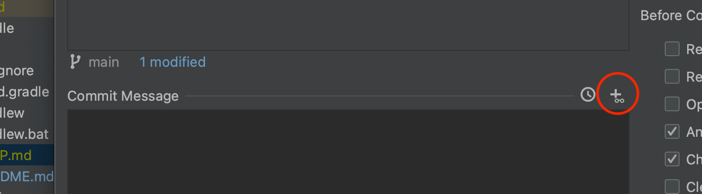
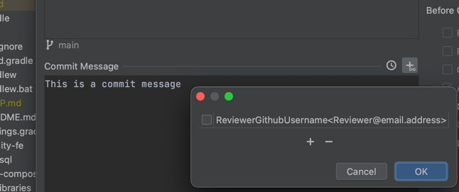
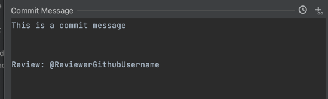

# Reviewer plugin

This plugin was created to choose easily reviewer for your git commit when it is needed.

### How to install: 

The plugin can be installed from your IDE: File / Settings / Plugins : 
- Browse Reviewer-plugin
- Install

Click on the highlighted icon, and you can reach the reviewer list:

Extend your list with new reviewer with the following format:
_githubUsernam &lt;some@email.address&gt;_

The plugin works with the list of [Co-author plugin](https://github.com/hawser86/co-author-plugin) as well, if the author list is saved with usernames.

The plugin will create the following mention:

This project was mentored by [VPecc](https://github.com/VPecc).
